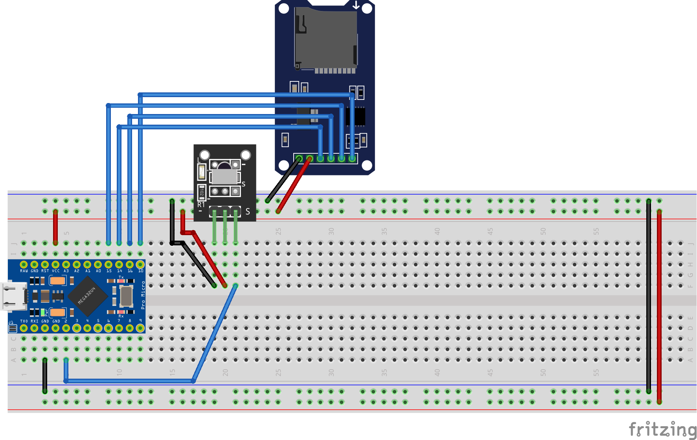

# Typeduino SD Card IR module
## Building and pinout instructions.
In order to build this module you will need:
- 1x Arduino Pro Micro
- 1x micro-SD card reader (HW-125)
- 1x IR Receiver
- 1x IR Transmitter (any cheap IR remote will do the job)

The pinout is as follows:
- PIN 2: IR Receiver
- PIN 10: CS Pin of SD card
- PIN 14: MISO Pin of SD card
- PIN 15: SCK Pin of SD card
- PIN 16: MOSI Pin of SD card



## Connection check
Once mounted, to check if the connection is correct, you can use the check_connection.ino sketch. It will check whether the SD card is connected and the IR receiver is working. 
In this step you should note the IR command for each button of the remote you are using. You will need this information later to modify the main script.

## Usage

First you need to get the IRLremote arduino library, made by NicoHood.
Download the zip file from https://github.com/NicoHood/IRLremote
Release 2.0.2 works fine
This library is needed instead of the default IRremote library because it is so much lighter and has dramatically less impact on the SRAM, which can lead to memory issues when executing large scripts.

After that, you need to input your own IR commands you got from the check_connection sketch in the main script. Do this in lines 29-34 of the Typeduino_IR_module.ino file:
```
#define BUTTON1 0x74B2F0AD
#define BUTTON2 0x85F2EAD
#define BUTTON3 0xA77BB6AD
#define BUTTON4 0x40BF10EF
#define BUTTON5 0x40BF50AF
#define BUTTON6 0x40BFB04F
```

Load ducky scripts on SD card and name it with 2 digits numbers. For example, 00.txt, 01.txt... 
Then, select the script you want to execute with the IR remote and the script will be executed.

If you need to add more buttons in order to use more scripts, you can add more buttons defining them after the BUTTON6 line and adding extra case causes in the switch statement in line 353.

## Debugging
If the device is not working properly there is a debug option you can activate in the code. Line 10 of the Typeduino_SD_module.ino file:
```
#define DEBUG true
```
This will print all kind of useful information on the serial monitor to diagnose the what is going wrong.

⚠️Warning⚠️ 

If you use the debug option the device will not work properly in computers that do not have Arduino IDE installed and running. This is because the debug option uses the Arduino Serial Monitor to print the debug information, and if it does not detect a valid Serial Port open, Typeduino will keep waiting for one indefinitely. If you want to use the device in a computer that does not have Arduino IDE installed, you need to disable the debug mode

⚠️Warning⚠️ 

Using the Typeduino with debug enabled can lead to more SRAM being used, which can lead to memory issues and unstability when executing large scripts.

## Different keyboard distributions 
With the Keyboard.h library, you can simulate a US keyboard distribution.

If you want to simulate a different keyboard distribution, you have to use another Keyboard library, because you may encounter errors executing keys like CTRL, ALT and alike.

In this repo a library for the spanish distribution is included in the lib folder. To use it you only have to import the zip archive into the Arduino IDE and select Keyboard_ES.h in line 19, commenting Keyboard.h in line 18.