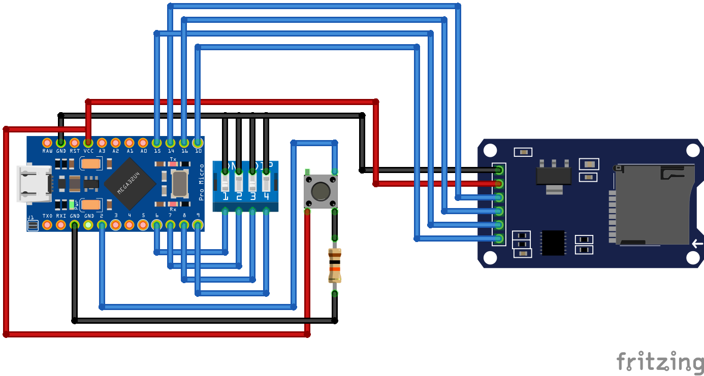

# Typeduino SD Card dip switch module

## Building and pinout instructions
In order to build this module, you need:
- 1x Arduino-like ATMega32U4 microcontroller
- 1x Button
- 1x 4 pin dip switch
- 1x micro-SD card reader (HW-125)
- 1x 10k Ω resistor

The pinout is as follows:
- PIN 2: Button
- PIN 6: DIP switch 1
- PIN 7: DIP switch 2
- PIN 8: DIP switch 3
- PIN 9: DIP switch 4
- PIN 10: CS Pin of SD card
- PIN 14: MISO Pin of SD card
- PIN 15: SCK Pin of SD card
- PIN 16: MOSI Pin of SD card



## Connection check

Once mounted, to check if the connection is correct, you can use the check_connection.ino sketch. It should return something like this:

```
Typeduino initialized

Checking SD Card connection 
Wiring is correct and a card is present.

Card type: SDHC

Files found on the card (name, date and size in bytes): 
0000.TXT      2022-09-08 09:50:08 15
Current dip switch state is: 0000
``` 

## Usage

Load ducky scripts on SD card and name it with the a switch state. For example, 0000.txt, 1000.txt... 
Then, select the script you want to execute with the dip switch and press the button. The script will be executed.

## Debugging

If the device is not working properly there is a debug option you can activate in the code. Line 10 of the Typeduino_SD_module.ino file:
```
#define DEBUG true
```
This will print all kind of useful information on the serial monitor to diagnose the what is going wrong.

⚠️Warning⚠️
If you use the debug option the device will not work properly in computers that do not have Arduino IDE installed and running. This is because the debug option uses the Arduino Serial Monitor to print the debug information, and if it does not detect a valid Serial Port open, Typeduino will keep waiting for one indefinitely. If you want to use the device in a computer that does not have Arduino IDE installed, you need to disable the debug mode

## Different keyboard distributions

With the Keyboard.h library, you can simulate a US keyboard distribution. 

If you want to simulate a different keyboard distribution, you have to use another Keyboard library, because you may encounter errors executing keys like CTRL, ALT and alike. 

In this repo a library for the spanish distribution is included in the lib folder. To use it you only have to import the zip archive into the Arduino IDE and select Keyboard_ES.h in line 19, commenting Keyboard.h in line 18. 